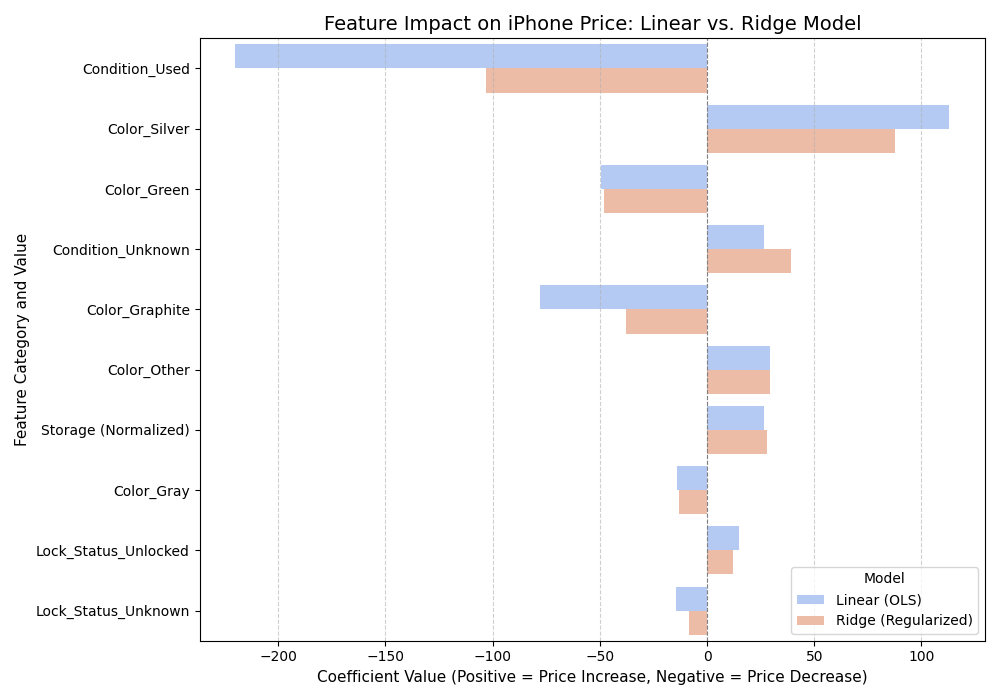

# 📱 iPhone 11 Pro Max Price Predictor 💰

> Scraped from real eBay listings. Cleaned from messy title text. Predicted with a regularized regression pipeline that refuses to crash.

This project delivers a **robust and resilient machine learning model** to predict the resale price of the **iPhone 11 Pro Max**, trained on real-world eBay listing data.

The primary focus of this solution is **stability** — ensuring the model provides reliable estimates **without crashing**, regardless of how messy the user's input might be. 🛡️

---

## 🛠️ Core Feature: Robustness Against Input Errors

We solved the common problem of model failure due to inconsistent or unseen data.

- **🔤 100% Case-Insensitive:**
  All categorical features (e.g., *Color*, *Condition*) are standardized to lowercase.
  Inputs like `"nEW"`, `"New"`, or `"SILVER"` are all handled seamlessly.

- **🛡️ Error-Proof Prediction:**
  The final model uses `OneHotEncoder(handle_unknown='ignore')` to automatically manage **new or unseen categories** (like a new color), ensuring **crash-free performance**.

---

## 🧠 Modeling and Techniques

The project employs a **complete scikit-learn pipeline** to ensure reproducibility, automation, and consistent behavior during both training and prediction.

### 1️⃣ Feature Engineering

Price prediction relies on four key features extracted from the raw title text using regex and string parsing:

- 💾 **Storage (GB)**
- 🎨 **Color**
- ✨ **Condition**
- 🔓 **Lock Status**

---

### 2️⃣ Model Comparison

We benchmarked two regression techniques to identify the most stable and generalizable model:

| Model | Technique | Benefit |
|:------|:-----------|:---------|
| **Linear Regression (OLS)** | Baseline | Simple and highly interpretable. |
| **Ridge Regression** | L2 Regularization | Shrinks coefficients to prevent overfitting and improves stability. (**Final chosen model**) ⭐ |

---

### 3️⃣ Key ML Concepts Used

- 🔧 **Pipeline & ColumnTransformer** – For structured, reproducible workflows.
- 📏 **StandardScaler** – Normalizes numeric features.
- 🏷️ **OneHotEncoder** – Handles categorical encoding safely.

---

## 📊 Model Performance & Insights

The final **Ridge Regression** model achieved:

- 🎯 **Mean Squared Error (MSE): ≈ 10,254** on the test set.
- 📈 **Strongest Positive Impact:** Storage (Normalized).
- 📉 **Strongest Negative Impact:** Condition → Unknown.

Feature importance visualization shows storage as the most significant driver of price, while poor condition decreases value sharply.



---

## ⚙️ Tech Stack

| Layer | Tools |
|:------|:------|
| Language | 🐍 Python |
| Data Handling | 🐼 Pandas, NumPy |
| Modeling | 🔬 Scikit-learn |
| Visualization | 📊 Matplotlib, Seaborn |

---

## 📂 Project Files

- `ebay-iphone-resale-model.py` — the full pipeline as a standalone script
- `ebay-iphone-resale-model.ipynb` — the original notebook with exploratory output
- `ebay-iphone-resale-model.pdf` — exported notebook for quick viewing
- `ebay_iphone_11_pro_max.csv` — the raw eBay listing data used for training
- `feature_importance_plot_enhanced.png` — the generated feature importance chart

---

## 🚀 Running It

```bash
git clone https://github.com/zain-the-npc/ebay-iphone-resale-model.git
cd ebay-iphone-resale-model
pip install -r requirements.txt
python ebay-iphone-resale-model.py
```

This trains both models, prints the comparison table, generates the feature importance plot, and then prompts you for an iPhone's specs to predict its resale price live. 📲💵

---

Built with ☕ and a healthy respect for messy real-world data.

